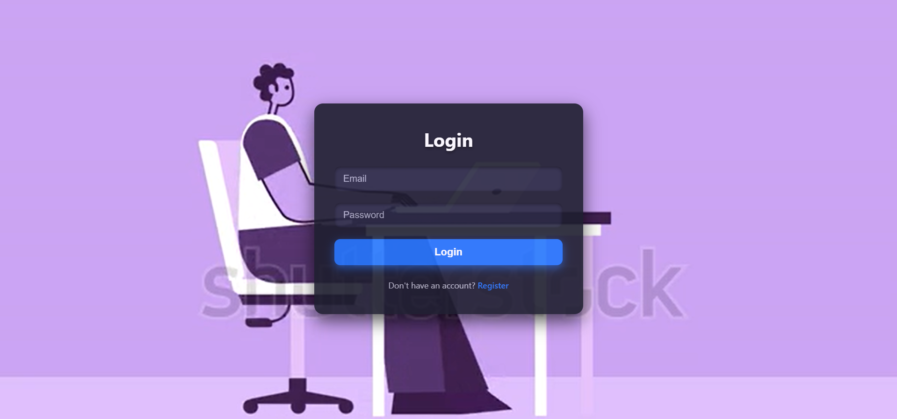
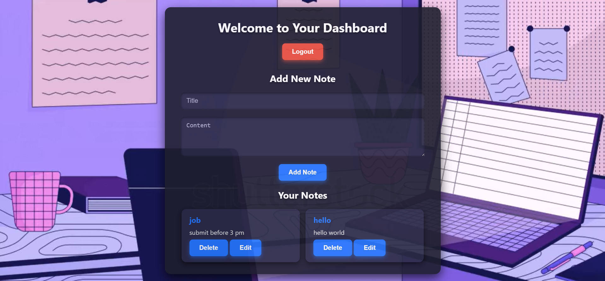

# 🛡️ Secure Notes App  

🚀 *First Full-Stack Project Completed!* 🎉  
From my very first HTML page to building a complete full-stack application — this project is a huge milestone in my developer journey.  
I wanted to create something genuinely useful, and what’s more important than having a secure place to store personal notes?  

---

## ✨ Features  

- 🔐 *User Authentication*  
  - Sign Up, Login, Logout  
  - Secure JWT-based sessions  

- 🗝️ *Password Security*  
  - Passwords hashed with *bcrypt*  
  - Authentication protected with *JWT*  

- 📝 *Notes Management*  
  - Create, Read, Update, Delete (CRUD) notes  
  - Each user’s notes stored securely & privately  

- 📂 *User-Specific Storage*  
  - Notes linked to your account only  
  - No one else can access them  

- 🎨 *UI & Responsiveness*  
  - Clean HTML + CSS frontend  
  - Fully responsive design (mobile & desktop)  

---

## 🖼 Screenshots  

### 🔐 Authentication  
  
  

### 🏠 Dashboard  
  

---

## 🛠 Tech Stack  

*Frontend*:  
- HTML  
- CSS  
- JavaScript  

*Backend*:  
- Node.js + Express.js  
- MongoDB Atlas  
- JWT Authentication  
- bcrypt Password Hashing  

---

## ⚙️ Installation  

Clone the repository and set up locally:

```bash
# Clone the repository
git clone https://github.com/coder40425/Secure-Notes-App.git
cd Secure-Notes-App

# --- Backend Setup ---
cd server
npm install

# Add a .env file with the following:
# MONGO_URI=your_mongo_atlas_uri
# JWT_SECRET=your_secret_key

npm run dev

# --- Frontend Setup ---
cd ../client
# If using plain HTML/CSS/JS, just open index.html in browser
# Or serve it via Live Server
